  

  
  
  
  

  
    <b>Tracklist</b>&nbsp;
    <a href="https://github.com/LemonMantis5571/Zest-Harness">Zest-Harness</a> ·
    <a href="https://github.com/LemonMantis5571/larp-linux">larp-linux</a> ·
    <a href="https://github.com/Ethereal-Lemons/LimeBot-OS">LimeBot-OS</a> ·
    <a href="https://github.com/LemonMantis5571/Aero-Webring">Aero-Webring</a> ·
    <a href="https://github.com/LemonMantis5571/A-mess-Visual-Novel-Project">A-mess Visual Novel</a> ·
    <a href="https://github.com/LemonMantis5571/MCP-Discord-Image-Downloader">MCP-Discord-Image-Downloader</a> ·
    <a href="https://github.com/Ethereal-Lemons/Ethereal-Theme">Ethereal-Theme</a> ·
    <a href="https://github.com/LemonMantis5571/PokeMMO-Utilities">PokeMMO-Utilities</a> ·
    <a href="https://github.com/Ethereal-Lemons/SilentFail">SilentFail</a>
  

